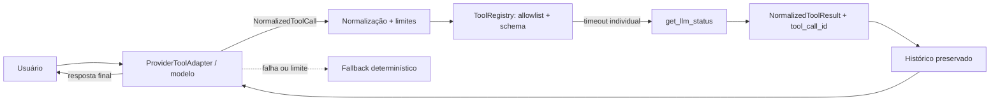

# E3I Tactical Intelligence

Aplicação web para inteligência tática de futebol. O fluxo prioriza vídeos de partidas, gera pré-análise visual, revisa evidências, visualiza grafos táticos, analisa movimentos e salva o dossiê no histórico local.

## Funcionalidades

- Seleção global de time ativo para consumir dados locais, fontes salvas e pendências de coleta nas telas.
- "Meu time": define qual time é o seu para habilitar o Confronto e evitar compará-lo contra si mesmo.
- Cadastro-ou-seleção automático ao iniciar uma análise: se o time já existe, é só selecionado; se não existe, cadastrar passa a ser a ação principal.
- Confronto: comparação lado a lado entre o seu time ativo e o time analisado (formação, pontos fortes/fracos, elenco).
- Busca pública restrita a materiais táticos e vídeos analisáveis, enriquecida com dados reais da Wikipedia (descrição e escudo do time, sem chave de API).
- Escudos dos times exibidos nos cards, no dossiê e no confronto para uma leitura mais visual.
- Pré-análise antes do salvamento.
- Análise por grafos com conexões entre rastros, zonas, centralidade e densidade.
- Leitura visual de vídeos com mapa de calor, trilhas de movimento, bola provável, homografia aproximada, eventos e recomendações, com barra de progresso ao vivo (SSE) durante o processamento.
- Pesquisa operacional real: escalação ótima por problema de atribuição (matching bipartido de peso máximo, exato) e comparação de cenários por formação com recomendação por estado de jogo (vencendo, empatando, perdendo).
- Relatório final consolidado para comissão técnica.
- Histórico persistido em SQLite.

## Arquitetura

```text
Frontend React/Vite
  -> cliente HTTP
Backend FastAPI
  -> busca publica tatica/video
  -> data_store JSON local
  -> graph_analysis
  -> video_vision
  -> SQLite
```

## Como Rodar

### Ambiente reproduzível

Pré-requisitos: Python 3.12 e Node.js 22. Execute a partir da raiz do repositório:

```bash
make install
make validate
```

Os comandos equivalentes, úteis para diagnóstico individual, são:

```bash
python -m pip install -r backend/requirements-dev.txt
python -m pytest -q
python -m compileall -q backend/app
npm --prefix frontend install
npm --prefix frontend test
npm --prefix frontend run build
make lint
```

O pytest usa a configuração raiz em `pyproject.toml`; não é necessário definir `PYTHONPATH` nem mudar para `backend`. Os testes usam dados temporários, desabilitam credenciais LLM e não dependem de chamadas externas ou pagas. O mesmo processo é executado por `.github/workflows/ci.yml`.

Backend:

```powershell
cd backend
python -m uvicorn app.main:app --reload --host 127.0.0.1 --port 8000
```

Frontend em desenvolvimento:

```powershell
cd frontend
npm install
npm run dev
```

Build servido pelo FastAPI:

```powershell
cd frontend
npm run build
cd ..
python -m uvicorn app.main:app --app-dir backend --host 127.0.0.1 --port 8000
```

Testes automatizados do backend:

```powershell
python -m pip install -r backend/requirements-dev.txt
python -m pytest -q
```

## Deploy Web

O projeto esta preparado para deploy Docker usando `Dockerfile` e `render.yaml`.

Guia completo:

```text
DEPLOY.md
```

Resumo para Render:

1. Suba o codigo para `https://github.com/marantmir/E3I-Tactical-Intelligence`.
2. Crie um `Blueprint` no Render apontando para o repositorio.
3. Configure `OPENAI_API_KEY` como secret, se quiser usar LLM real.
4. Publique e valide `/api/health`.

## Endpoints Principais

- `GET /api/teams`
- `GET /api/teams/options`
- `GET /api/teams/workspace/{team_ref}`
- `GET /api/teams/own-team` / `PUT /api/teams/own-team`
- `GET /api/teams/search?query=...`
- `GET /api/teams/{team_id}/public-intelligence`
- `GET /api/teams/{team_id}/graph-analysis`
- `GET /api/teams/{team_id}/operational-research?formation=4-3-3` (escalação ótima + cenários)
- `POST /api/teams/{team_id}/video-vision/upload` (síncrono)
- `POST /api/teams/{team_id}/video-vision/jobs` + `GET /api/teams/video-vision/jobs/{job_id}/events` (assíncrono com progresso ao vivo via SSE)
- `POST /api/analysis/preview`
- `POST /api/analysis`
- `GET /api/history`
- `POST /api/reports`

## Observações Técnicas

A busca pública evita dados institucionais e foca em materiais táticos, vídeos de jogos e análises públicas. Se a rede externa estiver bloqueada, o sistema preserva o fluxo com links estruturados para coleta manual.

As visualizações de grafos e vídeos são calculadas no backend a partir do conteúdo visual disponível e exibidas no frontend como apoio à decisão técnica.

### Visão computacional

O tracking usa predição por velocidade constante (estilo SORT) e atribuição global detecção-rastro ordenada por distância, com aposentadoria de rastros perdidos para evitar troca de identidade quando jogadores se cruzam ou saem do enquadramento. A detecção de bola aplica consistência temporal (candidatos que "teleportam" são descartados).

### Pesquisa operacional

`app/operational_research.py` resolve o problema de atribuição jogador-vaga com `networkx.max_weight_matching` (algoritmo blossom, exato). Cada atribuição carrega afinidade posicional, fit 0-10 e justificativa auditável. A comparação de cenários otimiza cada formação conhecida do time e recomenda uma por estado de jogo. Resultado exposto em `GET /api/teams/{team_id}/operational-research` e na tela Plano de Jogo.

### Segurança no deploy

- `E3I_ADMIN_TOKEN`: quando definido, todas as rotas `/api/admin/*` exigem o header `X-Admin-Token` com o mesmo valor (no navegador, salve com `localStorage.setItem("e3i_admin_token", "valor")`). Sem a variável, o comportamento aberto é mantido para uso local.
- `E3I_TRUST_PROXY=1`: atrás de proxy/load balancer (ex.: Render), faz o rate limit usar o primeiro IP de `X-Forwarded-For` em vez de agrupar todos os usuários no IP do proxy. Já habilitado no `render.yaml`.

### Camada LLM opcional

O backend usa uma camada LLM opcional para enriquecer consultas de busca, pré-análises, leitura tática do vídeo e hipóteses de identificação de time/jogador/número. Sem chave de API, o sistema continua operando com fallback local determinístico.

Pelo app, acesse `IA avançada` (`/future-ai`) para parametrizar:

- habilitar/desabilitar uso da LLM;
- informar API key;
- selecionar modelo;
- ajustar `top_p` (amostragem por núcleo), além de timeout, temperatura e limite de tokens;
- definir idioma, profundidade, escopo de busca e modo de identificação visual.

As configurações locais ficam em `backend/data/llm_config.json`, arquivo ignorado pelo Git por poder conter chave de API.

```powershell
$env:OPENAI_API_KEY="sua_chave"
$env:OPENAI_MODEL="gpt-4.1-mini"
$env:E3I_LLM_TIMEOUT_SECONDS="18"
```

Também é possível configurar por variáveis de ambiente. O modelo nunca deve inventar nomes de jogadores: quando OCR/crops da camisa não forem suficientes, a interface mantém a identidade como "não identificado" e orienta a confirmação visual.

Repositorio alvo: `https://github.com/marantmir/e3i-tactical-intelligence`

## Runtime nativo de ferramentas LLM (núcleo)



`backend/app/llm_tool_orchestrator.py` implementa o loop independente de provedor. O máximo padrão é 4 iterações e somente valores entre 1 e 8 são aceitos. Chamadas JSON são normalizadas, validadas e executadas apenas pelo `ToolRegistry`; resultados retornam ao mesmo modelo correlacionados por `tool_call_id`. Timeout e limites de entrada/saída são individuais, erros internos são sanitizados e logs registram somente duração, tool, status e provedor — nunca o conteúdo integral dos argumentos. Falha ou loop sem resposta final termina no fallback determinístico.

A prova offline inicial usa apenas `get_llm_status`, que não retorna a chave. **Esta etapa entrega o núcleo e o contrato de adaptador, não a integração nativa completa dos quatro provedores nem o catálogo tático.** Os fluxos textuais e multimodais existentes continuam preservados.

### Princípios do runtime

- Ausência de evidência não equivale a zero; o fallback declara limitações em vez de fabricar conteúdo.
- Entrada e saída são limitadas antes de retornarem ao modelo.
- Exceções e secrets não são incluídos nas respostas nem nos eventos de observabilidade.
- A allowlist impede execução arbitrária, mesmo quando o modelo pede uma tool desconhecida.
- Testes usam adaptadores mockados, nenhuma credencial e nenhuma chamada paga ou de rede.

## Processo de desenvolvimento e decisões

### Escolhas e alternativas consideradas

| Decisão | Alternativas avaliadas | Motivo e consequência |
|---|---|---|
| FastAPI + React/Vite | Next.js full-stack; Django | Preserva a separação do pipeline Python/OpenCV e uma UI leve. Em troca, deploy e contratos HTTP precisam ser mantidos em duas camadas. |
| APIs HTTP diretas dos provedores | SDK de cada fornecedor; LangChain/LlamaIndex | Evita quatro SDKs pesados e deixa payload, timeout e fallback auditáveis. O custo é manter adaptadores próprios e não herdar automaticamente recursos novos dos SDKs. |
| SQLite | PostgreSQL; somente JSON | É reproduzível sem serviço externo e suficiente para histórico local. Não é a escolha para escrita concorrente em escala; a migração para PostgreSQL fica indicada antes de uso multi-instância. |
| OpenCV + heurísticas auditáveis | Detector supervisionado proprietário | Funciona sem GPU/modelo adicional e expõe limites. Perde precisão em oclusão, identidade e câmera fechada; portanto a saída é hipótese revisável, não verdade de campo. |
| Até seis quadros JPEG anotados | Vídeo integral no modelo; um único frame | Distribui evidências relevantes pelo vídeo com custo/latência limitados. Pode omitir um lance entre amostras, mitigado pelo vídeo anotado e revisão humana. |
| Fallback determinístico | Falhar a requisição sem chave/rede | Mantém o endpoint funcional e testável. A UI identifica o provedor e a confiança para não confundir fallback com inferência do modelo. |

Não foi adotado um framework de agentes porque o fluxo é conhecido, curto e sensível a evidência: coleta → CV → contexto estruturado → uma síntese JSON → revisão humana. O núcleo de tool calling nativo agora permite que uma resposta normalizada solicite tools, mas os adaptadores reais dos provedores e o catálogo tático ainda não foram conectados. Essa distinção é deliberadamente explícita: **busca, OCR, CV e pesquisa operacional ainda não são anunciados como functions/tools do provedor**.

### Estratégia de prompting

Os prompts ficam junto de cada caso de uso em `backend/app/llm_assistant.py`, e o histórico/contratos estão em `docs/prompts.md`. A estratégia é:

1. delimitar o papel (analista de desempenho) e o universo permitido (futebol);
2. enviar somente fontes, métricas e quadros selecionados pelo pipeline;
3. exigir JSON e separar observação, inferência, confiança e próxima validação;
4. proibir nomes, placar e jogadas sem evidência;
5. cruzar a observação multimodal com métricas de CV e registrar divergências;
6. preservar um resultado determinístico quando não há chave, imagem ou rede.

O exemplo few-shot completo e os casos adversariais estão em `docs/prompts.md`; eles demonstram a diferença entre evidência observável e inferência aceitável.

### Parâmetros e hipótese de configuração

- `temperature=0.2`: baixa variância para relatório técnico e JSON estável.
- `top_p=0.9`: remove a cauda menos provável sem tornar toda resposta idêntica. Em avaliação controlada, altere **temperatura ou top-p, não ambos**, para atribuir o efeito observado.
- `max_output_tokens=1400`: comporta observações por quadro e resumo, evitando respostas abertas excessivas.
- `timeout=18s`: compromisso para uma requisição multimodal pequena em deploy web; timeout aciona fallback explícito.
- `gpt-4.1-mini` é o padrão por custo/latência, não uma alegação de superioridade. A tela permite repetir o mesmo caso nos quatro provedores.

Para comparação reproduzível, use o protocolo e a planilha-modelo de `docs/evaluation-checklist.md`: congele entrada, quadros e rubric; rode três repetições por configuração; registre validade JSON, aderência às evidências, alucinações, latência e custo informado pelo provedor. Chaves reais não são versionadas, por isso resultados pagos não são fabricados neste repositório.

## O que funcionou, o que falhou e como o agente foi usado

### Funcionou

- Iterações pequenas com testes de rota e unidade detectaram regressões de persistência, fallback e payload multiprovedor.
- A separação entre CV e LLM permitiu corrigir a lacuna inicial em que o modelo recebia apenas números: agora os quadros reais anotados também são enviados.
- Fallbacks locais e mocks tornaram build/testes reproduzíveis sem chaves ou egress.
- A inspeção visual revelou problemas que testes HTTP não capturavam, como sobreposição de controles e falta de feedback no processamento.

### Falhou ou teve resultado limitado

- A primeira versão chamava de “análise visual por LLM” uma síntese baseada somente em métricas; o modelo **não via imagens**. A solução foi capturar e enviar quadros-chave reais e renomear/expor a etapa multimodal.
- Buscas reais de Wikipedia/DuckDuckGo falharam em ambientes com egress bloqueado. Foram validadas com mocks e mantêm coleta guiada como fallback; isso não prova disponibilidade do serviço externo.
- Tracking heurístico não identifica com segurança jogadores em oclusão ou camisa ilegível. O sistema mantém “não identificado” e solicita confirmação, em vez de completar nomes.
- A tentativa de cobrir vídeo longo lendo apenas os primeiros `max_frames` enviesava a análise. A amostragem passou a distribuir seeks por toda a duração e ganhou testes para metadado ausente/incorreto.
- Tool calling nativo ainda não foi implementado. As ferramentas alimentam o contexto pelo backend; documentar honestamente essa lacuna evita atribuir ao modelo uma autonomia que ele não tem.

### Registro do agente

`docs/agent-log.md` registra pedidos, hipótese, implementação, validação e limitações por entrega; `docs/prompts.md` preserva prompts representativos e evolução. O agente foi usado para implementar, escrever testes, executar `pytest`/build e revisar o diff. Decisões de produto (identidade sem evidência, custo de quadros e ausência de login) permaneceram explícitas e sujeitas a revisão humana.
