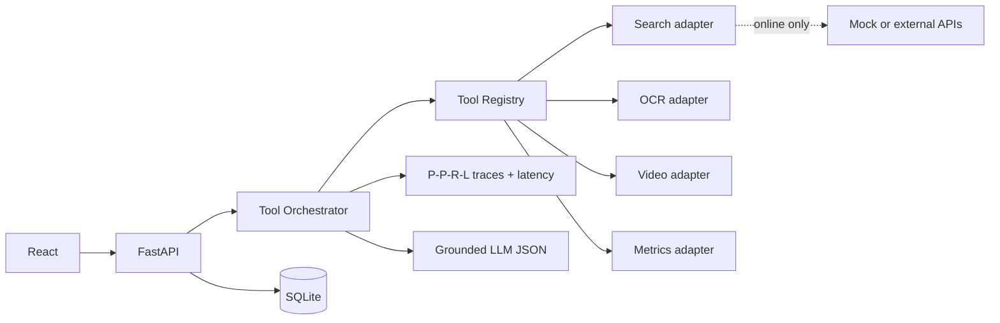

# E3I Tactical Intelligence

Aplicação web para inteligência tática de futebol. O fluxo prioriza vídeos de partidas, gera pré-análise visual, revisa evidências, visualiza grafos táticos, analisa movimentos e salva o dossiê no histórico local.

## Funcionalidades

- Seleção global de time ativo para consumir dados locais, fontes salvas e pendências de coleta nas telas.
- "Meu time": define qual time é o seu para habilitar o Confronto e evitar compará-lo contra si mesmo.
- Cadastro-ou-seleção automático ao iniciar uma análise: se o time já existe, é só selecionado; se não existe, cadastrar passa a ser a ação principal.
- Confronto: comparação lado a lado entre o seu time ativo e o time analisado (formação, pontos fortes/fracos, elenco).
- Busca pública restrita a materiais táticos e vídeos analisáveis, enriquecida com dados reais da Wikipedia (descrição e escudo do time, sem chave de API).
- Escudos dos times exibidos nos cards, no dossiê e no confronto para uma leitura mais visual.
- Pré-análise antes do salvamento.
- Análise por grafos com conexões entre rastros, zonas, centralidade e densidade.
- Leitura visual de vídeos com mapa de calor, trilhas de movimento, bola provável, homografia aproximada, eventos e recomendações, com barra de progresso ao vivo (SSE) durante o processamento.
- Pesquisa operacional real: escalação ótima por problema de atribuição (matching bipartido de peso máximo, exato) e comparação de cenários por formação com recomendação por estado de jogo (vencendo, empatando, perdendo).
- Relatório final consolidado para comissão técnica.
- Histórico persistido em SQLite.

## Arquitetura

```text
Frontend React/Vite
  -> cliente HTTP
Backend FastAPI
  -> busca publica tatica/video
  -> data_store JSON local
  -> graph_analysis
  -> video_vision
  -> SQLite
```

## Como Rodar

Backend:

```powershell
cd backend
python -m uvicorn app.main:app --reload --host 127.0.0.1 --port 8000
```

Frontend em desenvolvimento:

```powershell
cd frontend
npm install
npm run dev
```

Build servido pelo FastAPI:

```powershell
cd frontend
npm run build
cd ..
python -m uvicorn app.main:app --app-dir backend --host 127.0.0.1 --port 8000
```

Testes automatizados do backend:

```powershell
cd backend
pip install -r requirements-dev.txt
pytest
```

## Deploy Web

O projeto esta preparado para deploy Docker usando `Dockerfile` e `render.yaml`.

Guia completo:

```text
DEPLOY.md
```

Resumo para Render:

1. Suba o codigo para `https://github.com/marantmir/E3I-Tactical-Intelligence`.
2. Crie um `Blueprint` no Render apontando para o repositorio.
3. Configure `OPENAI_API_KEY` como secret, se quiser usar LLM real.
4. Publique e valide `/api/health`.

## Endpoints Principais

- `GET /api/teams`
- `GET /api/teams/options`
- `GET /api/teams/workspace/{team_ref}`
- `GET /api/teams/own-team` / `PUT /api/teams/own-team`
- `GET /api/teams/search?query=...`
- `GET /api/teams/{team_id}/public-intelligence`
- `GET /api/teams/{team_id}/graph-analysis`
- `GET /api/teams/{team_id}/operational-research?formation=4-3-3` (escalação ótima + cenários)
- `POST /api/teams/{team_id}/video-vision/upload` (síncrono)
- `POST /api/teams/{team_id}/video-vision/jobs` + `GET /api/teams/video-vision/jobs/{job_id}/events` (assíncrono com progresso ao vivo via SSE)
- `POST /api/analysis/preview`
- `POST /api/analysis`
- `GET /api/history`
- `POST /api/reports`

## Observações Técnicas

A busca pública evita dados institucionais e foca em materiais táticos, vídeos de jogos e análises públicas. Se a rede externa estiver bloqueada, o sistema preserva o fluxo com links estruturados para coleta manual.

As visualizações de grafos e vídeos são calculadas no backend a partir do conteúdo visual disponível e exibidas no frontend como apoio à decisão técnica.

### Visão computacional

O tracking usa predição por velocidade constante (estilo SORT) e atribuição global detecção-rastro ordenada por distância, com aposentadoria de rastros perdidos para evitar troca de identidade quando jogadores se cruzam ou saem do enquadramento. A detecção de bola aplica consistência temporal (candidatos que "teleportam" são descartados).

### Pesquisa operacional

`app/operational_research.py` resolve o problema de atribuição jogador-vaga com `networkx.max_weight_matching` (algoritmo blossom, exato). Cada atribuição carrega afinidade posicional, fit 0-10 e justificativa auditável. A comparação de cenários otimiza cada formação conhecida do time e recomenda uma por estado de jogo. Resultado exposto em `GET /api/teams/{team_id}/operational-research` e na tela Plano de Jogo.

### Segurança no deploy

- `E3I_ADMIN_TOKEN`: quando definido, todas as rotas `/api/admin/*` exigem o header `X-Admin-Token` com o mesmo valor (no navegador, salve com `localStorage.setItem("e3i_admin_token", "valor")`). Sem a variável, o comportamento aberto é mantido para uso local.
- `E3I_TRUST_PROXY=1`: atrás de proxy/load balancer (ex.: Render), faz o rate limit usar o primeiro IP de `X-Forwarded-For` em vez de agrupar todos os usuários no IP do proxy. Já habilitado no `render.yaml`.

### Camada LLM opcional

O backend usa uma camada LLM opcional para enriquecer consultas de busca, pré-análises, leitura tática do vídeo e hipóteses de identificação de time/jogador/número. Sem chave de API, o sistema continua operando com fallback local determinístico.

Pelo app, acesse `IA avançada` (`/future-ai`) para parametrizar:

- habilitar/desabilitar uso da LLM;
- informar API key;
- selecionar modelo;
- ajustar timeout, temperatura e limite de tokens;
- definir idioma, profundidade, escopo de busca e modo de identificação visual.

As configurações locais ficam em `backend/data/llm_config.json`, arquivo ignorado pelo Git por poder conter chave de API.

```powershell
$env:OPENAI_API_KEY="sua_chave"
$env:OPENAI_MODEL="gpt-4.1-mini"
$env:E3I_LLM_TIMEOUT_SECONDS="18"
```

Também é possível configurar por variáveis de ambiente. O modelo nunca deve inventar nomes de jogadores: quando OCR/crops da camisa não forem suficientes, a interface mantém a identidade como "não identificado" e orienta a confirmação visual.

Repositorio alvo: `https://github.com/marantmir/e3i-tactical-intelligence`

## Runtime de Inteligência Tática



O runtime em `backend/app/intelligence` registra ferramentas por contrato e recebe suas dependências por injeção. O modo padrão é `offline`: ferramentas de rede são ignoradas com anotação `DADO_AUSENTE`, enquanto OCR, vídeo e métricas locais continuam. Use `E3I_INTELLIGENCE_MODE=online` apenas com adaptadores e secrets configurados no ambiente. Consulte o [relatório de validação](docs/validation-report.md), o [índice de ADRs](docs/validation-report.md#adr-index) e a [apresentação técnica](docs/technical-presentation.md).

### Lessons Learned

- Ausência de evidência não equivale a zero; deve ser um estado explícito, com motivo e procedência.
- Reparar envelopes JSON é seguro; “reparar” conteúdo tático ausente seria fabricação e permanece proibido.
- Injeção de adaptadores torna APIs externas mockáveis e mantém CI offline determinístico.
- Medir antes de paralelizar preserva rastros reproduzíveis e cria uma linha de base real de latência.
