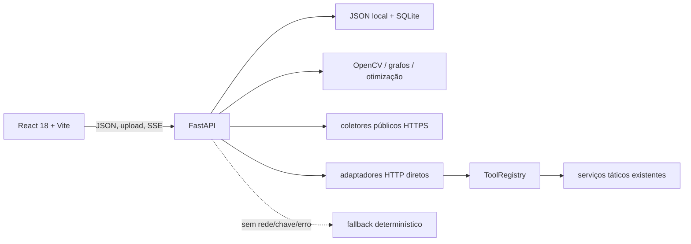

# Arquitetura as-built

## Visão geral

O frontend é uma SPA com rotas carregadas sob demanda. O backend expõe CRUD, análise, busca, vídeo síncrono e jobs com progresso SSE. JSON versionado fornece o catálogo inicial; SQLite mantém histórico/configuração operacional local. Uploads e configuração privada são dados de runtime ignorados pelo Git.

## Fluxos implementados

1. **Dossiê:** time → fontes locais/públicas → métricas/grafo → pré-análise → relatório e histórico.
2. **Vídeo:** upload ou URL YouTube permitida → amostragem distribuída → CV heurística → quadros anotados → síntese opcional multimodal → revisão humana.
3. **LLM:** contexto estruturado → adaptador direto do provedor → chamada de tool normalizada → allowlist/schema/limite/timeout → resultado correlacionado → resposta estruturada. Falta de credencial, falha esgotada ou contrato inválido termina em fallback explícito.
4. **Experimentos:** fixture fixa → runner offline sem socket → JSON/CSV/Markdown determinísticos.

## Fronteiras e segurança

- `ToolRegistry` é a única fronteira de execução de tools: nomes permitidos, Pydantic com campos extras proibidos, limites de entrada/saída, timeout e erro público sanitizado.
- Chamadas de coleta passam por HTTPS, resolução DNS de todos os endereços, bloqueio de IP não global e revalidação de no máximo três redirects. URLs de YouTube possuem allowlist própria. DNS e validação na aplicação reduzem SSRF, mas a barreira definitiva deve ser egress firewall/proxy.
- Uploads têm tamanho/formato e rate limit; CORS é configurável; admin pode exigir token. Logs estruturados registram metadados e request ID, não payloads/chaves.
- Credenciais vêm do ambiente ou de configuração local ignorada. `.env.example` contém somente nomes vazios.
- CI valida suíte/build/lint/links, arquivos sensíveis, dependências e histórico com Gitleaks.

## Estado e limites operacionais

O modo offline é funcional e foi validado hermeticamente. Busca pública, downloads e quatro provedores dependem de rede; inferência real depende também de credencial e não foi validada nesta entrega. CV, OCR, identificação, confiança e recomendações são heurísticas revisáveis. SQLite, armazenamento local e rate limit em memória são adequados a uma instância, não a escala horizontal.

## Decisões relacionadas

- [ADR 0001 — APIs diretas de provedores versus frameworks](adr/0001-direct-provider-apis-vs-frameworks.md)
- [Prompts e contrato estruturado](prompts.md)
- [Catálogo de tools](tool-catalog.md)
- [Capacidades dos provedores](provider-capabilities.md)
